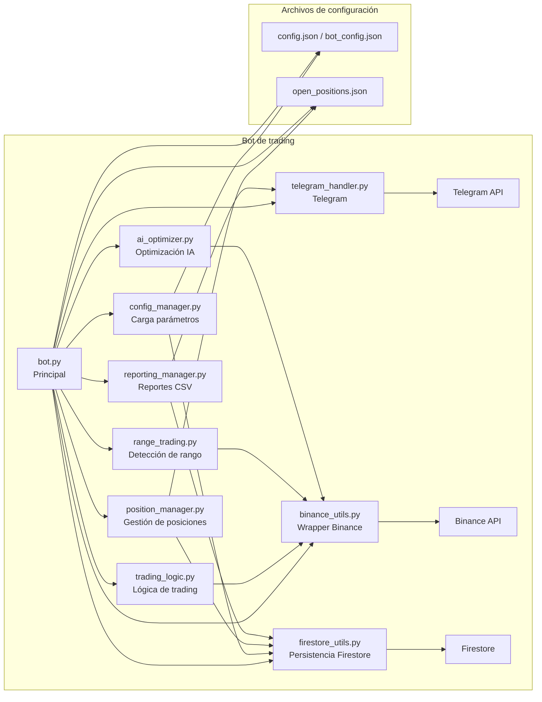

# Organigrama de la aplicación

Este diagrama muestra la estructura principal del bot de trading y sus dependencias.

## Descripción breve

- `bot.py`: núcleo principal que inicia el ciclo, comunica con Binance, gestiona Telegram y coordina la lógica.
- `config_manager.py`: carga y guarda parámetros de configuración.
- `position_manager.py`: administra posiciones abiertas y persistencia.
- `binance_utils.py`: wrappers y utilidades para llamadas a Binance.
- `telegram_handler.py`: envía/recibe mensajes y comandos de Telegram.
- `trading_logic.py`: contiene la lógica de decisión de compra/venta.
- `range_trading.py`: detecta mercado lateral y señales de rango.
- `reporting_manager.py`: genera reportes y CSV de transacciones.
- `ai_optimizer.py`: módulo de optimización de parámetros.
- `firestore_utils.py`: conexión con Firestore para persistencia.

Servicios externos:
- Binance API
- Telegram API
- Firestore
